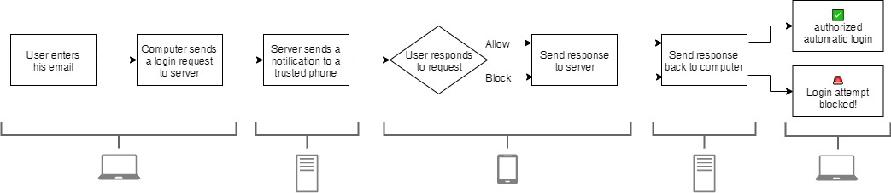
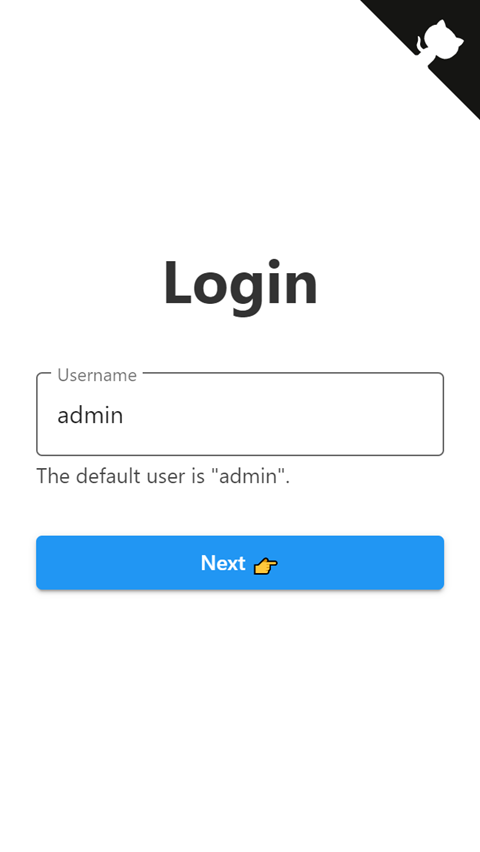
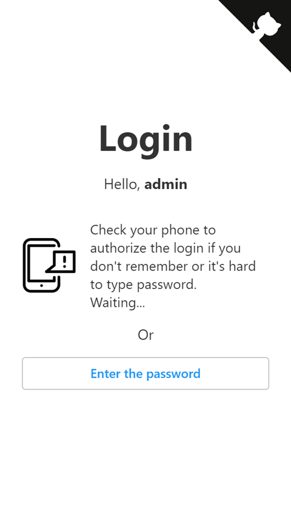
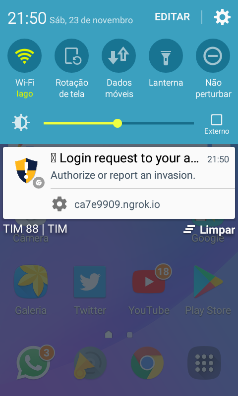

# passwordless-login-via-notification

Passwords sucks!

## Flow chart

The flow is the same as the method called "[magic link](https://hackernoon.com/magic-links-d680d410f8f7)" except login request is sent by push notification instead of email.



## Security:

When I made this demo I just wanted to test this concept as soon as possible so I didn't do a lot of security checks, but here is a list of tips for when you make your own implementation:

- Passwordless login must be optional.
- Only one phone can be registered as trusted.
- Activation must be done on the phone that user will use to authorize requests.
- User must confirm that he has a lock screen.
- You must show infos about the device that are trying to log in so user can identify.
- There must be a time limit for user to authorize the request.
- When request is answered (yes or no) or time limit is reached, it should be discarded and no longer can be valid.
- You should help user in case of intrusion attempt.
- Block multiple login requests from the same device.

## Start this server

```
git clone https://github.com/iagobruno/passwordless-login-via-notification.git
cd passwordless-login-via-notification
yarn install
node server.js
```

## Screenshots
|      |      |      |      |      |
| ---- | ---- | ---- | ---- | ---- |
||||||
